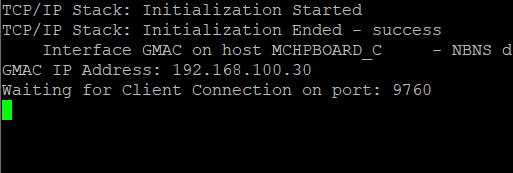
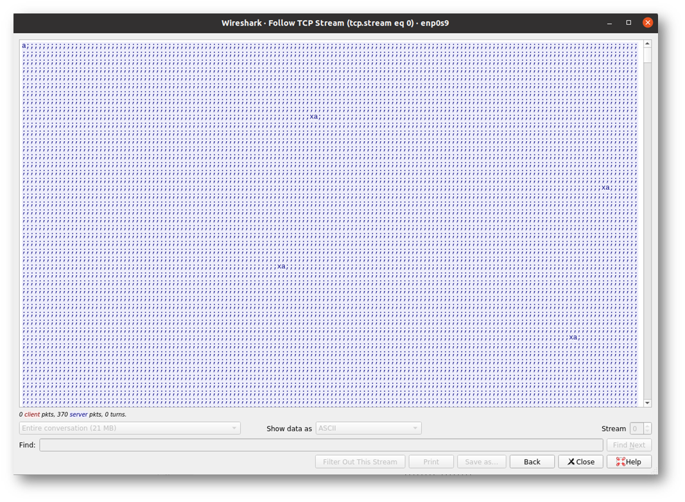

# SAME54 Curiosity Ultra Berkeley API Server Demo

## Description:

This project implements a TCP/IP stack using the Berkeley API wrapper. The SAME54 Curiosity Ultra acts as a TCP Server and transmits a continuous stream of data to a client.
The client program is implemented in C.

## Hardware Used:

- SAME54 Curiosity Ultra Development Board
- KSZ8061 PHY Daughter Board

## Software Used:

The project has been tested in the following versions:

- MPLABX IDE v6.15
- XC32 v2.50
- Harmony3
  - csp v3.13.1
  - core v3.11.1
  - dev_packs v3.13.0
  - littlefs v2.6.0
  - wolfssl v4.7.0
  - net v3.10.0
  - crypto v3.7.6

## Setup:

1. Mount the KSZ8061 module to the Ethernet PHY Module slot (J800 to J803) 
2. Connect USB cable for programming and power
3. Connect an ethernet cable from the KSZ8061 to the host computer running the client application.

## Running the Code:

The SAME54 TCP server should start up as soon as power is applied.

1. Open a terminal application such as PuTTY or TeraTerm.
2. Power up the SAME54 Curiosity Ultra. The following should show:

3. From the client machine, compile the client program with

gcc -o client berkeleyAPIclient.c

4. Run the client with

./client

5. The client program will echo the data being sent by the server. This may be further verified by observing the Wireshark capture.
It should be similar to the stream below:

## History:

| Date        | Description     | Modified By:            |
| ----------- | --------------- | ----------------------- |
| 12-Oct-2023 | Initial release | [A69614] - N. Arriola   |
|             |                 |                         |

